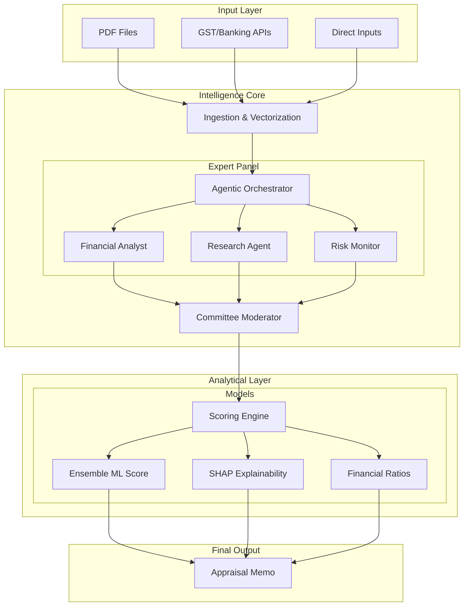

# Intelli-Credit: AI-Powered Corporate Credit Decisioning Engine

**Revolutionizing SME and Corporate Lending through Collaborative Multi-Agent Intelligence.**

---

## Project Solution Overview
**Intelli-Credit** is an AI powered platform designed to replace fragmented, manual, and subjective credit appraisal processes with an autonomous, high-precision decisioning engine. It acts as a **virtual credit committee**, simulating human expert reasoning to provide structured, explainable, and institution-grade credit recommendations for SME and corporate borrowers.

By integrating multi-agent orchestration with advanced machine learning, the solution eliminates data silos, reduces appraisal turnaround time from weeks to minutes, and provides a "Source of Truth" for credit decisions.

---

## Key Features
*   **Agentic Orchestration**: Autonomous agents (Financial, Research, Fraud, Risk) that parallelize deep-dive analysis.
*   **Dynamic Schema Manager**: Configurable extraction layers for diverse document types (Balance Sheets, GST, Bank Statements).
*   **High-Precision Classification**: Automated document sorting with human-in-the-loop validation.
*   **Autonomous Research**: Real-time web-crawling for litigation, promoter news, and sector-specific headwinds.
*   **Explainable Scoring**: Full **SHAP** attribution for transparency in credit grading.
*   **GenAI Narrative Engine**: Automatically drafts detailed analyst commentary and SWOT insights.
*   **CAM Generation**: Produces a downloadable, institutional-ready Credit Appraisal Memo (PDF).

---

## Unique Value Propositions (UVP)
1.  **Committee-Style Intelligence**: Mimics human expert debate for superior accuracy compared to standard ML models.
2.  **Audit-Ready Explainability**: Every score is mathematically linked to specific features, ensuring regulatory compliance.
3.  **Real-Time Fraud Graphs**: Spots inter-connected shell companies and circular trading network risks autonomously.
4.  **Forward-Looking Analysis**: Uses **Prophet** forecasting and sector outlook scores rather than just relying on historical data.
5.  **Context-Aware Ingestion**: Natively understands Indian complex financial structures (GSTR-2A/3B, MCA filings, etc.).

---

## Tech Stack
| Layer | Technologies |
| :--- | :--- |
| **Backend** | Python 3.10+, FastAPI, LangChain |
| **Frontend** | React 18, Vite, Vanilla CSS |
| **Database** | Pinecone (Vector DB), JSON/File-based storage |
| **ML Engine** | XGBoost, LightGBM, Random Forest, Prophet |
| **Logic/Reasoning** | OpenAI GPT-4o, Pydantic, NetworkX |
| **Deployment** | Render (Backend), Vercel (Frontend) |

---

## Technical Flow
1.  **Data Ingestion**: Raw PDFs/APIs are processed through the Ingestion Engine.
2.  **Vectorization & Retrieval**: Documents are chunked and stored in Pinecone for RAG-based context.
3.  **Collaborative Reasoning**: The Multi-Agent Orchestrator assigns tasks to expert agents.
4.  **Ensemble Scoring**: Extracted features are fed into parallel ML models (XGBoost/LGBM).
5.  **Explainability Analysis**: SHAP values are computed to identify key risk/protector drivers.
6.  **Narrative Synthesis**: GenAI combines quantitative scores and qualitative findings into a narrative report.

---

## Process Flow


---

## System Architecture


---

## Exact Project Structure
```text
Intelli-Credit/
├── backend/                    # Core decision engine (Python)
│   ├── agents/                 # Multi-agent logic & LangChain implementation
│   │   ├── orchestrator.py     # Central coordinator
│   │   ├── credit_agent.py     # Credit evaluation specialist
│   │   └── tools.py            # Agent research tools
│   ├── ml/                     # Machine learning scoring pipeline
│   │   └── credit_model.py     # Ensemble model & SHAP analysis
│   ├── api/                    # REST API endpoints (FastAPI)
│   │   └── main.py             # Entry point
│   ├── ingestion/              # Data parsing and vectorization logic
│   ├── classification/         # Document type identification models
│   ├── schema/                 # Dynamic schemas for extraction
│   ├── analysis/               # SWOT & narrative generation logic
│   ├── cam_generator/          # PDF report (CAM) creation
│   ├── fraud_graph/            # NetworkX fraud detection
│   ├── decision_engine/        # Final decision & pricing logic
│   ├── gan/                    # CTGAN implementation for data augmentation
│   └── rag/                    # RAG-based document interrogation
├── frontend/                   # UI Application (React)
│   ├── src/                    # Components & Styles
│   │   ├── App.jsx             # Comprehensive UI logic
│   │   └── App.css             # Formal/Professional theme
│   ├── public/                 # Static assets
│   ├── package.json            # Node dependencies
│   ├── vite.config.js          # Build configuration
│   └── vercel.json             # Proxy/Deployment configuration
├── requirements.txt            # Backend dependencies
├── runtime.txt                 # Platform runtime specification
├── render.yaml                 # Backend deployment blueprint
└── README.md                   # Systematic documentation
```

---

## Steps to Run Locally

### 1. Prerequisites
*   Python 3.10+ & Node.js 16+
*   Git installed
*   API Keys: OpenAI, Pinecone, Tavily

### 2. Setup Backend
```bash
# Clone the repository (Private Project)
git clone <repository-url>
cd Intelli-Credit

# Create and activate virtual environment
python -m venv .venv
source .venv/bin/activate  # Windows: .venv\Scripts\activate

# Install requirements
pip install -r requirements.txt

# Start the development server
uvicorn backend.api.main:app --reload
```

### 3. Setup Frontend
```bash
cd frontend

# Install node modules
npm install

# Start the Vite development server
npm run dev
```
The application will launch at `http://localhost:5173`.
```
```
YouTube Link: [Intelli-Credit](https://youtu.be/maHg_Yy0GCQ)
```
```
Deployed URL: [Intelli-Credit-AI Powered Multi-Agent Credit Decision Engine](https://intelli-credit-ai-enterprise-credit.vercel.app/)
```
```
---
*Note: This is a private project and not open-source. Unauthorized distribution is prohibited.*
